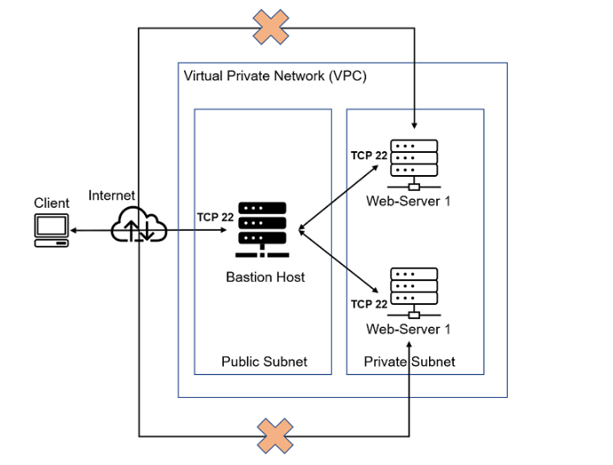
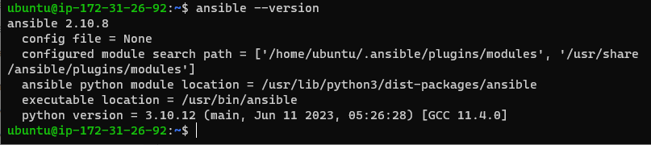
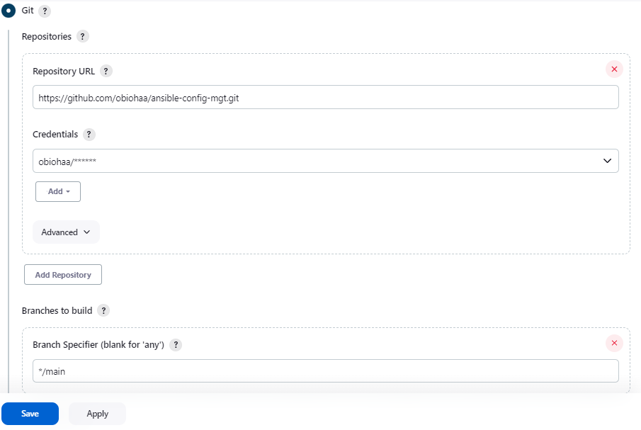
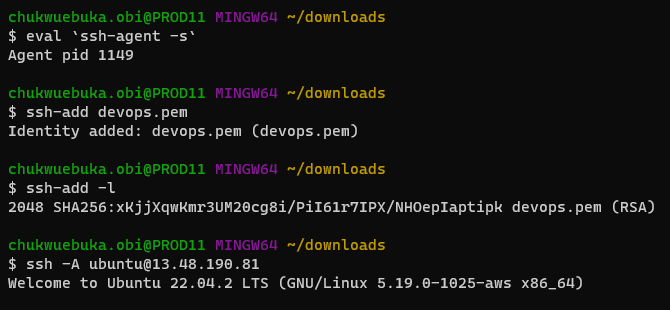
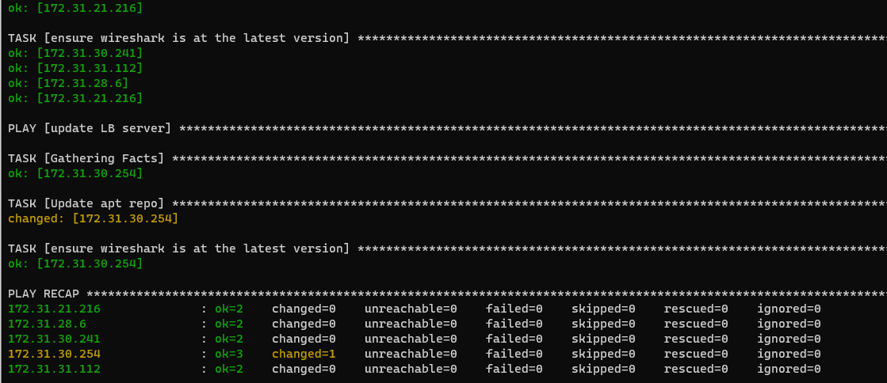

## **ANSIBLE CONFIGURATION MANAGEMENT**

So far we have been installing and configuring EC2 servers manually by going into the servers and installing the softwares. 

Now we want to automate this process by using ansible playbook.

 **A --Ansible Client as a Jump Server**

 A Jump Server (sometimes also referred as Bastion Host) is an intermediary server through which access to internal network can be provided. This means that the Bastion host will be accessed via a public IP but the internal architecture and all instances will not be accessed via SSH or any channel.

 

 **B --Install and configure ansible in EC2 instances**

 1. First we update our EC2 from the name ansible to ansible-jenkins. Here we will run our playbook.
 2. In our git-hub account we will create a repository name 'ansible-config-mgt'
 3. Let's update our instance and install ansible in the instance

    `sudo apt update`

    `sudo apt install ansible`

 4. We can check our ansible version by running 
    
    `ansible --version`



5. Next we will configure jenkins build job to save our repository content every time you change it.

- First we create a freestyle project called ansible in Jenkins
- Then we register our git repository into the created project as shown below.



- Then we configure a post-build job to save all ** files.
- We can test our setup by updating our git reprository (our README.md) and watch it get built in Jenkins
- We can find the build in our instance using the code below.

`ls /var/lib/jenkins/jobs/ansible/builds/<build_number>/archive/`

6. Next we will configure our IDE visual studio code to connect to our github and our instance. W do this by installing "Remote Development" extension.

7. We will clone down our ansible-config-mgt repo to our jenkins-ansible instance.

`git clone <ansible-config-mgt repo link>`

**C --ANSIBLE DEVELOPMENT**

1. In our ansible-config-mgt github repo, create a new branch that will be used for development.

2. Checkout the newly created feature branch to your local machine and start building your code and directory structure

    `git checkout -b prj-11`

3. create a directory and name it playbooks, it will be used to store all our playbook files.

4. Create a directory and name it inventory – it will be used to keep our hosts organised.

5. Within the playbooks folder, create your first playbook, and name it common.yml

6. Within the inventory folder, create an inventory file (.yml) for each environment (Development, Staging Testing and Production) dev, staging, uat, and prod respectively.

**Note:** Ansible uses TCP port 22 by default, which means it needs to ssh into target servers from Jenkins-Ansible host – for this you can implement the concept of ssh-agent. Now you need to import your key into ssh-agent:

`eval 'ssh-agent -s'`

`ssh-add <path-to-private-key>`

Confirm the key has been added with the command below, you should see the name of your key

`ssh -A ubuntu@public-IP`



- Also notice, that your Load Balancer user is ubuntu and user for RHEL-based servers is ec2-user.

- Update our inventory/dev.yml file with this snippet code below.

``````
[nfs]
<NFS-Server-Private-IP-Address> ansible_ssh_user='ec2-user'

[webservers]
<Web-Server1-Private-IP-Address> ansible_ssh_user='ec2-user'
<Web-Server2-Private-IP-Address> ansible_ssh_user='ec2-user'

[db]
<Database-Private-IP-Address> ansible_ssh_user='ec2-user' 

[lb]
<Load-Balancer-Private-IP-Address> ansible_ssh_user='ubuntu'
``````

**C --CREATE A COMMON PLAYBOOK**

1. It is time to start giving Ansible the instructions on what you needs to be performed on all servers listed in inventory/dev.

2. In common.yml playbook we will configure for repeatable, re-usable, and multi-machine tasks that is common to systems within the infrastucture. Update our playbooks/common.yml file with the below code.

``````
---
- name: update web, nfs and db servers
  hosts: webservers, nfs, db
  remote_user: ec2-user
  become: yes
  become_user: root
  tasks:
    - name: ensure wireshark is at the latest version
      yum:
        name: wireshark
        state: latest

- name: update LB server
  hosts: lb
  remote_user: ubuntu
  become: yes
  become_user: root
  tasks:
    - name: Update apt repo
      apt: 
        update_cache: yes

    - name: ensure wireshark is at the latest version
      apt:
        name: wireshark
        state: latest
``````

Let's make sense out of the code above. This playbook is divided into two parts, each of them is intended to perform the same task: install wireshark utility (or make sure it is updated to the latest version) on your RHEL 8 and Ubuntu servers. It uses root user to perform this task and respective package manager: yum for RHEL 8 and apt for Ubuntu.

3. Now, all of our files and directory are in our machine and we need to push the changes made locally into GitHub.

4. Use the below git commands to check status, add files/folders, commit and push to GitHub

``````
git status

git add <selected files>

git commit -m "commit message"

git push origin -u prj-ll
``````

5. After this, do a pull request, review the codes pushed to GitHub and if its all good, we will merge the doe to the master branch.

6. Next we will go back into our terminal and checkout from the prj-11 branch to the master branch and pull down the latest changes.

    `git checkout main`

    `git pull`

7. Once our code changes appear in master (main) branch – Jenkins will do its job and save all the files (build artifacts) to /var/lib/jenkins/jobs/ansible/builds/<build_number>/archive/ directory on Jenkins-Ansible server.

**C --RUN FIRST ANSIBLE TEST**

Now we execute our ansible-playbook command and verify if our playbook actaully works.

`cd ansible-config-mgt`

`ansible-playbook -i inventory/dev.yml playbooks/common.yml`

- Or run the below if you run the ansible playbook from your vscode/terminal

` ansible-playbook -i /var/lib/jenkins/jobs/ansible/builds/ansible-build-number/archive/inventory/dev.yml /var/lib/jenkins/jobs/ansible/builds/2/archive/playbooks/common.yml`




- Next we go to each server and check if wireshark has been installed b running the below code

`which wireshark`

`wireshark --version`


Our update with ansible architecture now looks like this:


** --THE END**
another